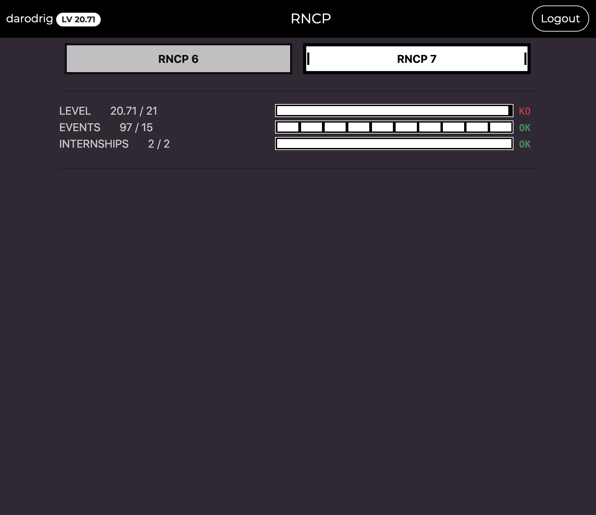

# RNCP Planner for 42 School



## How to build

### Development

1. Edit `flask/.env` and set `CLIENT_ID`, `CLIENT_SECRET`, `SECOND_CLIENT_SECRET`, and `REDIRECT_URI`
2. Replace the redirect url in the environment.ts
3. Execute:

```bash
docker compose run angular npm install
docker compose up -d
```

### Production

0. Edit flask/.env
1. Exec:
```bash
docker compose run angular sh -c "rm -rf node_modules && npm install && ng build"
```

2. Uncomment the prod server on nginx.conf
    2.1 Set SSL certificates
3. Replace redirect url in the environment.ts
4. Exec:
```bash
docker compose up -d nginx flask
```