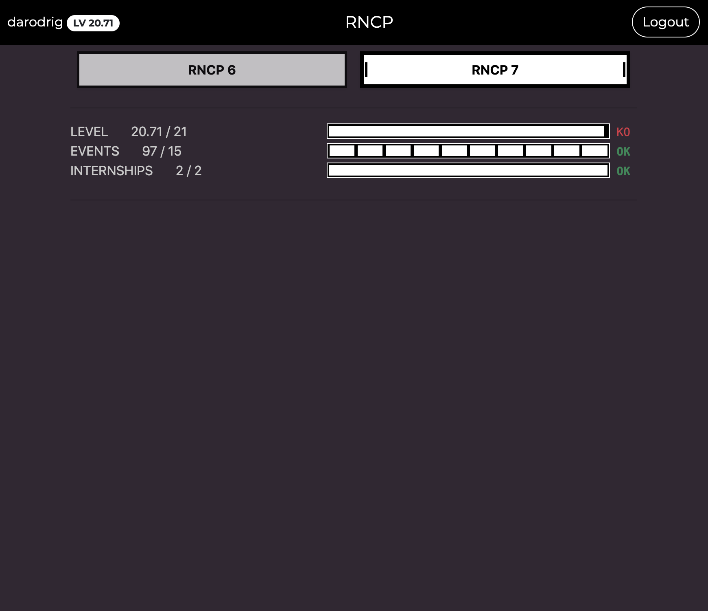

# RNCP Planner for 42 School



RNCP Planner is a helper tool for 42 students. At 42, progression is project-based: each validated project grants XP, and XP increases your level. This project lets you simulate planned project validations to estimate your future level and track your RNCP progression.

## Running RNCP Planner locally

<!-- <details> -->
<summary>Click to expand local setup instructions</summary>

### Prerequisites

Before you begin, ensure you have the following installed on your system:

- [Docker](https://www.docker.com/)

### 1. Create a 42 API key

To use 42 OAuth and retrieve user projects, you must create an API key from the 42 intra.

1. Visit the 42 API [OAuth page](https://profile.intra.42.fr/oauth/applications).
2. Create a new application and use the following callback URL:

```text
http://localhost:3000/auth/callback/42
```

### 2. Configure environment variables

Create or edit `flask/.env` and fill it with the variables used by this project.

#### Example `flask/.env` file

```env
# UID of your 42 OAuth application
CLIENT_ID="u-s4t2ud..."

# Secret of your 42 OAuth application
CLIENT_SECRET="s-s4t2ud..."

# next secret
SECOND_CLIENT_SECRET="s-s4t2ud..."

# Must match your 42 OAuth application callback URL
REDIRECT_URI="http://localhost:3000/auth/callback/42"
```

> [!TIP]
> For local deployment, `CLIENT_ID`, `CLIENT_SECRET`, `SECOND_CLIENT_SECRET` and `REDIRECT_URI` are required.

### 3. Run RNCP Planner

With everything set up, run:

```bash
docker compose run angular npm install
docker compose up -d
```

Access the app at http://localhost:3000.

> [!NOTE]
> If recent JSON/config changes do not appear immediately, force a browser hard refresh (`Ctrl+Shift+R`).

<!-- </details> -->